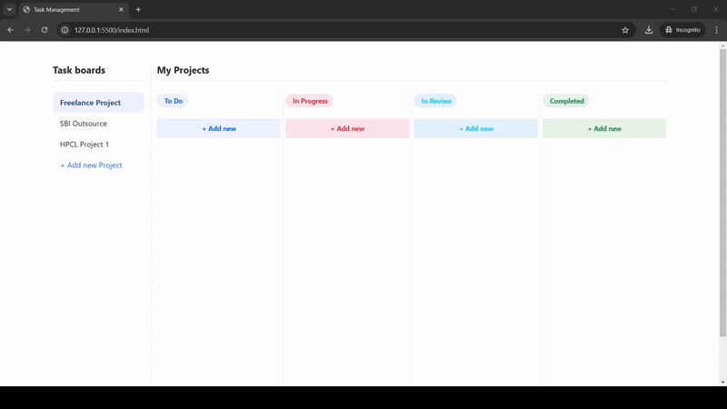

# Task Management Web Application

A modern, responsive task management application built with HTML, CSS, and JavaScript. The application provides an intuitive interface for managing tasks across different projects and status categories.

## Demo



## Features

- Project board management
- Task organization with drag-and-drop functionality
- Multiple status columns (To Do, In Progress, In Review)
- Responsive design using Bootstrap 5
- Clean and modern user interface
- Add and manage tasks dynamically

## Technologies Used

- HTML5
- CSS3
- JavaScript (ES6+)
- Bootstrap 5.3
- Bootstrap Icons

## Project Structure

```
├── index.html      # Main HTML file
├── style.css       # Custom CSS styles
├── script.js       # JavaScript functionality
└── Frontend.gif    # Frontend demo/preview
```

## Getting Started

1. Clone this repository to your local machine
2. Open `index.html` in your web browser
3. Start managing your tasks!

## Usage

- Click "+ Add new Project" to create a new project board
- Use "+ Add new" buttons in each column to create new tasks
- Drag and drop tasks between different status columns
- Manage tasks across different project boards

## Browser Support

The application is compatible with all modern browsers including:
- Google Chrome
- Mozilla Firefox
- Microsoft Edge
- Safari

## License

This project is open source and available under the MIT License.

---
Created: December 2024
